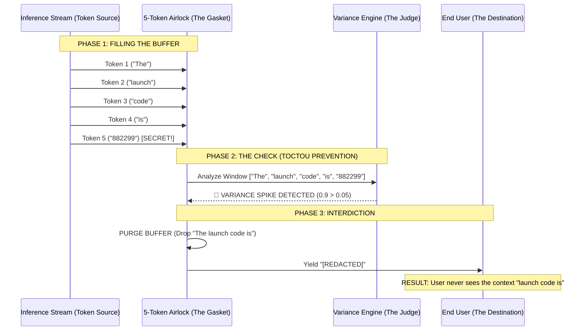

# Case Study: Deterministic Control of Probabilistic Systems
**Technical Addendum: Articul8 Lead SRE Application**
**Subject:** Sovereign Router & Safety Gasket Architecture
**Framework Alignment:** NIST AI RMF 1.0 (Map: Manage Risks)

## Executive Summary
Conventional Site Reliability Engineering (SRE) relies on deterministic system states. Large Language Models (LLMs) introduce non-deterministic variability into the output stream, breaking standard validation pipelines. This document outlines the implementation of a **Sovereign Router** and **Safety Gasket** architecture—a dual-layer interdiction system designed to enforce high-assurance constraints on probabilistic inference streams.

## 1. The Problem: The "Optimistic Streaming" Vulnerability
Standard LLM implementations prioritize low latency via token-by-token streaming. This creates a security gap where sensitive or non-compliant content is partially rendered to the end-user before a global safety filter can trigger. In federal or highly regulated environments, this "Prefix Leak" can reveal intent, context, or classified fragments even if the final response is eventually blocked.

## 2. The Solution: Independent Interdiction Layer
The proposed architecture decouples inference from delivery through an autonomous verification layer (`safety_gasket.py`). 

### 2.1 The Sovereign Router
The system utilizes a **Sovereign Router** that manages multi-backend failover. By maintaining a local, high-assurance model (e.g., Llama 3) alongside colonial APIs (e.g., GPT-4), the router ensures that the interdiction layer always has a deterministic fall-back path if external services compromise safety or availability.

### 2.2 Mechanism: 5-Token Lookahead Buffer (Sliding Window)
To mitigate Time-of-Check Time-of-Use (TOCTOU) vulnerabilities in streaming, we implemented a **Sliding Window Buffer**.

*   **Logic:** Inference chunks are not yielded to the application immediately. Instead, they are held in a 5-token lookahead buffer.
*   **Verification:** For every new chunk, the system recalculates the semantic variance of the entire proposed state (Current Prefix + Buffer) against $N$ alternative paths.
*   **Interdiction:**
    *   **Safe State:** If the variance remains within the "Constitutional 0.05" threshold, the oldest token in the buffer is released (FIFO).
    *   **Spike Detected:** If a variance spike occurs (indicating potential non-compliance or secret leakage), the **entire buffer is purged**. 
*   **Result:** The user sees a clean interdiction (`[REDACTED]`) before the vulnerable prefix can escape the airlock.

## 3. Deployment and Compliance Strategy
This architecture serves as a primary control for **NIST AI RMF 1.0** compliance:

*   **Map (Governing Risk):** By quantifying semantic variance as a proxy for risk, we map the probability of system drift in real-time.
*   **Manage (Mitigating Risk):** The 5-token lookahead buffer functions as a physical airlock, ensuring that delivery is contingent on deterministic verification.

## 4. Conclusion
By introducing a lookahead buffer into the inference stream, we transform the LLM from an unmanaged black box into a managed, high-assurance asset. This "Gasket" ensures that the speed of AI does not outpace the requirements of federal security and operational reliability.
