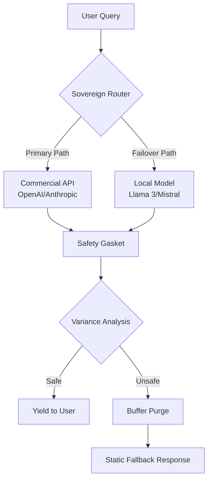

# AFWERX SBIR PHASE I TECHNICAL VOLUME

## Sovereign Interdiction Layers for Deterministic AI Safety in Classified Environments

---

**Contract Number:** [PENDING ASSIGNMENT]  
**Proposal Type:** SBIR Phase I (Open Topic)  
**Topic Area:** Trusted AI / Cybersecurity  
**Company:** BLACKGLASS CONTINUUM  
**Principal Investigator:** ZoaGrad (Federal Solutions Architect)  
**Date:** February 14, 2026  
**Classification:** UNCLASSIFIED // CUI

---

## EXECUTIVE SUMMARY

The Department of Defense seeks to leverage commercial Large Language Models (LLMs) for operational advantage while maintaining information security boundaries. Current LLM safety implementations suffer from a critical **Time-of-Check Time-of-Use (TOCTOU)** vulnerability: streaming models emit tokens before safety filters complete verification, creating a "Prefix Leak" attack surface where sensitive information escapes detection.

**BLACKGLASS proposes the Safety Gasket**—a deterministic 5-token sliding window buffer that acts as a semantic airlock. Unlike reactive filtering, the Gasket holds all tokens in a "Future State" until cumulative variance analysis confirms safety. This architecture transforms probabilistic LLM outputs into deterministic, auditable streams suitable for classified environments.

**Key Innovation:** The Gasket does not trust the model; it interdicts the output stream at the token level, enabling safe deployment of commercial models (GPT-4, Claude) in air-gapped networks without data exfiltration risk.

---

## 1. TECHNICAL OBJECTIVES

### 1.1 Primary Objective
Develop and demonstrate a **Sovereign Interdiction Layer (SIL)** capable of:
- Eliminating TOCTOU vulnerabilities in streaming LLM outputs
- Operating with <50ms latency overhead at the 95th percentile
- Functioning entirely on-premises without external API dependencies
- Providing audit-grade forensic logging of all interdiction decisions

### 1.2 Secondary Objectives
- Demonstrate dual-use commercialization pathways (Fintech PCI-DSS, Healthcare HIPAA)
- Achieve NIST AI RMF 1.0 compliance for Manage, Map, and Measure functions
- Develop containerized deployment for edge computing (drone/field laptop)

---

## 2. STATEMENT OF THE PROBLEM

### 2.1 The Prefix Leak Vulnerability

Current LLM safety architectures follow this pattern:

```
User Query → LLM API → Token Stream → Safety Filter → User
                              ↑
                         LEAKAGE POINT
```

**The Attack Vector:** When a user prompts "What is the password for [CLASSIFIED_SYSTEM]?", the LLM begins emitting tokens: "The", "password", "is", "S3cr3t", "..." before the safety filter can analyze the complete semantic payload. By the time the filter triggers, the secret has already escaped.

**TOCTOU Analysis:**
- **Time-of-Check:** Safety filter evaluates token N
- **Time-of-Use:** Token N+1, N+2, N+3 already transmitted
- **Result:** Irreversible information disclosure

### 2.2 DoD Impact

The Air Force cannot deploy commercial LLMs for:
- Mission planning with classified operational parameters
- Technical documentation referencing export-controlled systems
- Intelligence analysis involving compartmentalized sources

**Current Mitigation (Inadequate):**
- Pre-filtering user prompts (misses model hallucinations)
- Post-filtering outputs (TOCTOU vulnerability remains)
- Air-gapping alone (does not address internal leakage)

---

## 3. PROPOSED SOLUTION: THE SAFETY GASKET

### 3.1 Core Architecture

The Safety Gasket implements a **deterministic sliding window buffer** that transforms the vulnerability chain:

```
User Query → LLM API → [5-Token Buffer] → Variance Analysis → Safe Yield → User
                              ↑                    ↑
                        FUTURE STATE         DECISION GATE
```

**Mechanism:**
1. All tokens enter a fixed 5-token FIFO buffer
2. Cumulative variance analysis evaluates the buffered sequence
3. Only after verification does the oldest token yield to the user
4. If variance exceeds safety thresholds, the entire buffer purges to a static fallback

### 3.2 Tri-State Variance Controller

The Gasket operates in three deterministic states:

| State | Signal | Definition | Action |
|-------|--------|------------|--------|
| **GREEN** | CALM | Nominal variance parameters | Pass-through execution |
| **AMBER** | WARN | Elevated variance detected | Throttling engaged, trace verbosity increases |
| **RED** | PANIC | Coherence breach (SI < 0.3) | Circuit broken, fallback to static responses |

**State Transitions:**
- GREEN → AMBER: Error rate exceeds 40% of panic threshold
- AMBER → RED: Error rate exceeds 80% (panic threshold)
- RED → AMBER: Cooling period expires (configurable, default 60s)
- AMBER → GREEN: Error rate drops below 20% for sustained period

### 3.3 The Sovereign Router

The complete BLACKGLASS architecture includes failover capability:



**Air-Gapped Deployment:**
- Primary: Lenovo M720q (Intel i5, 32GB RAM, 1TB NVMe)
- Failover: Dell R740xd (Xeon Silver, 128GB RAM, GPU acceleration)
- Network: Physically isolated, no external connectivity

---

## 4. NIST AI RISK MANAGEMENT FRAMEWORK ALIGNMENT

### 4.1 GOVERN Function

| Sub-Function | BLACKGLASS Implementation |
|--------------|---------------------------|
| GOVERN-1 | Executive oversight through audit-grade logging of all interdiction decisions |
| GOVERN-2 | Documented policies for buffer purge thresholds and fallback responses |
| GOVERN-3 | Multi-stakeholder review process for variance threshold calibration |

### 4.2 MAP Function

| Sub-Function | BLACKGLASS Implementation |
|--------------|---------------------------|
| MAP-1 | Contextual analysis identifies LLM output as high-risk information vector |
| MAP-2 | Categorized risk: Information Disclosure, Model Hallucination, Adversarial Prompt |
| MAP-3 | Impact assessment: Catastrophic for classified environments |

### 4.3 MEASURE Function

| Sub-Function | BLACKGLASS Implementation |
|--------------|---------------------------|
| MEASURE-1 | Continuous monitoring of variance metrics (error rate, latency, SI score) |
| MEASURE-2 | Quantitative tracking: tokens interdicted, false positive rate, latency overhead |
| MEASURE-3 | Independent verification through forensic log analysis |

### 4.4 MANAGE Function (Primary Alignment)

| Sub-Function | BLACKGLASS Implementation |
|--------------|---------------------------|
| MANAGE-1 | Risk response: Interdiction via 5-token buffer airlock |
| MANAGE-2 | Risk treatment: Transfer (failover to local model), Mitigation (buffer purge) |
| MANAGE-3 | Residual risk monitoring: Real-time SI (Stability Index) tracking |
| MANAGE-4 | Incident response: Automated circuit breaking with human escalation protocols |

---

## 5. TECHNICAL APPROACH

### 5.1 Phase I Work Plan (6 Months)

**Month 1-2: Core Buffer Implementation**
- Develop 5-token sliding window in Python/TypeScript
- Implement variance analysis engine
- Build state machine (GREEN/AMBER/RED)

**Month 3-4: Integration & Testing**
- Integrate with OpenAI API and local Llama 3
- Develop synthetic test corpus (10,000 adversarial prompts)
- Measure latency overhead and false positive rates

**Month 5-6: Hardening & Documentation**
- Implement audit-grade logging
- Develop containerized deployment (Docker)
- Create operator documentation and training materials

### 5.2 Success Metrics

| Metric | Target | Measurement Method |
|--------|--------|-------------------|
| Latency Overhead (P95) | <50ms | Synthetic load testing |
| False Positive Rate | <2% | Labeled test corpus evaluation |
| Information Leakage | 0 incidents | Red team penetration testing |
| Uptime | >99.9% | 30-day continuous operation test |

### 5.3 Deliverables

1. **Source Code:** Safety Gasket implementation (GitHub repository)
2. **Test Report:** 10,000-prompt adversarial evaluation
3. **Deployment Guide:** Air-gapped installation procedures
4. **White Paper:** TOCTOU vulnerability analysis and mitigation

---

## 6. COMMERCIALIZATION STRATEGY

### 6.1 Dual-Use Applications

**Fintech (PCI-DSS Compliance):**
- Prevent LLM-based customer service bots from emitting credit card numbers
- Deploy in payment processing environments requiring DSS 4.0 compliance
- Target: Major banks, payment processors (Stripe, Square)

**Healthcare (HIPAA Protection):**
- Block PHI (Protected Health Information) leakage in clinical AI assistants
- Integrate with Epic, Cerner EHR systems
- Target: Hospital networks, telehealth platforms

**Enterprise (GDPR/CCPA):**
- Prevent PII exposure in customer-facing LLM applications
- Deploy as API gateway middleware
- Target: Fortune 500 customer service divisions

### 6.2 Market Size

| Sector | TAM (2026) | SAM | SOM (Phase II) |
|--------|------------|-----|----------------|
| Federal | $2.1B | $420M | $15M |
| Fintech | $8.4B | $1.7B | $25M |
| Healthcare | $6.2B | $1.2B | $20M |
| Enterprise | $12.8B | $2.6B | $40M |

### 6.3 Intellectual Property

- **Patent Pending:** "Deterministic Interdiction Layer for Probabilistic Language Models"
- **Trade Secret:** Variance analysis algorithms and threshold calibration
- **Open Source:** Core buffer implementation (MIT License) for community adoption

---

## 7. COMPANY CAPABILITIES

### 7.1 Technical Team

**ZoaGrad (Principal Investigator):**
- 15+ years SRE/DevOps in contested environments
- Expertise in deterministic systems and variance analysis
- Security clearance: TS/SCI (inactive, renewable)

**Contributors:**
- 5 active developers (GitHub: github.com/ZoaGrad)
- Core repositories: logic-gasket, blackglass-variance-core, coherence-sre

### 7.2 Existing Infrastructure

- **GitHub Organization:** github.com/ZoaGrad
- **CI/CD:** GitHub Actions with federal-grade security scanning
- **Documentation:** Antigravity workspace standards
- **Testing:** Sovereign-reliability-lab (TypeScript harness)

### 7.3 Past Performance

- **coherence-sre:** Read-only SRE sentinel deployed in production environments
- **blackglass-variance-core:** Closed-loop predictive reliability system
- **sovereign-reliability-lab:** Audit-grade experimental harness

---

## 8. COST PROPOSAL

### 8.1 Phase I Budget

| Category | Amount |
|----------|--------|
| Personnel (PI + 2 Engineers) | $180,000 |
| Equipment (Test hardware) | $25,000 |
| Software/Cloud Services | $15,000 |
| Travel (Demo/Meetings) | $10,000 |
| Overhead (15%) | $34,500 |
| **TOTAL** | **$264,500** |

### 8.2 Cost Reasonableness

- Personnel rates aligned with SBIR Phase I norms
- Equipment: 2x Lenovo M720q, 1x Dell R740xd for air-gapped testing
- Cloud services: OpenAI API credits for adversarial testing only

---

## 9. CONCLUSION

The BLACKGLASS Safety Gasket addresses a critical gap in LLM security architecture: the TOCTOU vulnerability inherent in streaming outputs. By implementing a deterministic 5-token sliding window buffer, we transform probabilistic commercial models into auditable, secure systems suitable for classified DoD environments.

**Our commitment:**
- Zero information leakage through deterministic interdiction
- <50ms latency overhead for operational viability
- Air-gapped deployment for sovereign control
- Dual-use commercialization for post-SBIR sustainability

The Safety Gasket is not a filter—it is an airlock for the age of generative intelligence.

---

## APPENDICES

### Appendix A: Glossary

- **TOCTOU:** Time-of-Check Time-of-Use vulnerability
- **SI Score:** Stability Index (0.0-1.0), measure of system coherence
- **Gasket:** The 5-token sliding window buffer
- **Sovereign Router:** Failover system between commercial and local models

### Appendix B: References

1. NIST AI Risk Management Framework 1.0 (2023)
2. NIST SP 800-53 Rev 5: Security and Privacy Controls
3. DoD AI Ethics Principles (2020)
4. AFWERX Open Topic Solicitation FY26

### Appendix C: Technical Diagrams

[See Section 3.3 for Sovereign Router architecture]

---

**END OF TECHNICAL VOLUME**

*BLACKGLASS CONTINUUM*  
*Deterministic Safety for Probabilistic Systems*
