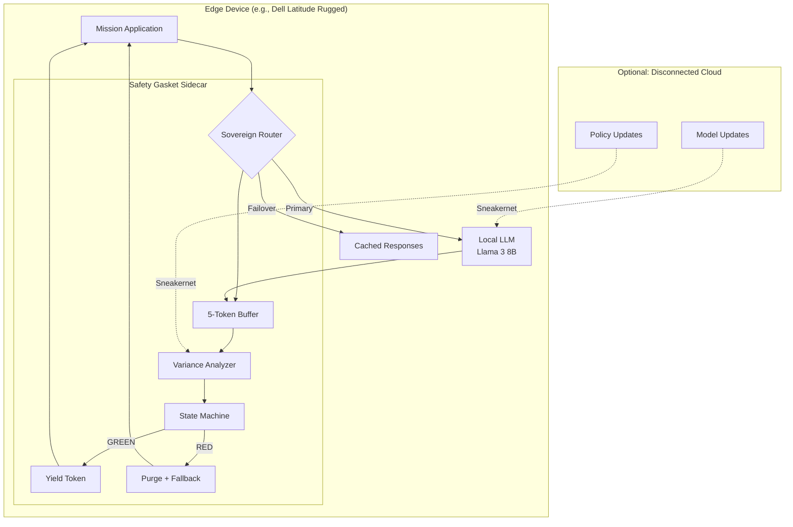
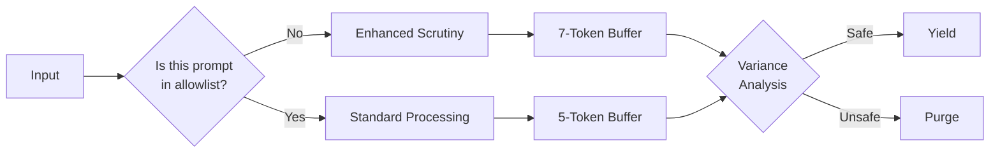

# DIU SOLUTION BRIEF
## Trusted AI / Blue UAS for Logic

---

**Organization:** BLACKGLASS CONTINUUM  
**Solution:** Sovereign Interdiction Layer (SIL) for Edge AI  
**Classification:** UNCLASSIFIED // CUI  
**Date:** February 14, 2026  
**Point of Contact:** ZoaGrad (Federal Solutions Architect)  
**Email:** [REDACTED]  
**Phone:** [REDACTED]

---

## 1. EXECUTIVE SUMMARY

**The Mission:** Deploy trusted AI capabilities on edge devices (drones, tactical laptops, ground vehicles) where network connectivity is contested or non-existent.

**The Problem:** Commercial LLMs are too large for edge deployment, but local models lack safety guarantees. Current solutions either:
- Require constant cloud connectivity (vulnerable to jamming)
- Deploy unfiltered local models (risk of information leakage)
- Use rule-based filters (easily bypassed by adversarial prompts)

**The BLACKGLASS Solution:** A lightweight, containerized **Safety Gasket** that runs as a sidecar on edge devices—filtering LLM output in real-time with <50ms latency and zero external dependencies.

**The Pitch:** Blue UAS for Logic. Just as Blue UAS provides trusted drone hardware, BLACKGLASS provides trusted AI software—deterministic safety for probabilistic systems.

---

## 2. OPERATIONAL CONTEXT

### 2.1 Edge AI Use Cases

| Platform | Mission | AI Function | Risk |
|----------|---------|-------------|------|
| **Small UAS** | ISR (Intelligence, Surveillance, Reconnaissance) | Object recognition, target classification | Misclassification leads to collateral damage |
| **Tactical Laptop** | Field intelligence analysis | Document summarization, pattern recognition | Leakage of classified sources/methods |
| **Ground Vehicle** | Autonomous navigation | Route planning, threat assessment | Compromised routes endanger personnel |
| **Maritime Drone** | Harbor patrol | Anomaly detection, vessel identification | False positives waste resources |

### 2.2 The Contested Environment

Edge deployments face unique challenges:
- **Intermittent connectivity:** Cloud-based safety filters unavailable
- **Resource constraints:** Limited compute, memory, power
- **Adversarial conditions:** Active jamming, spoofing, prompt injection
- **Time-critical decisions:** Latency budgets measured in milliseconds

---

## 3. TECHNICAL SOLUTION

### 3.1 The Edge Gasket Architecture



### 3.2 Containerized Deployment

**Docker Configuration:**
```dockerfile
# Dockerfile.gasket
FROM python:3.11-slim

# Minimal dependencies for edge
RUN pip install --no-cache-dir \
    torch --index-url https://download.pytorch.org/whl/cpu \
    transformers \
    numpy

# Gasket core (lightweight)
COPY logic_gasket.py /app/
COPY variance_analyzer.py /app/
COPY config/edge.yaml /app/config/

# Resource limits for edge
CMD ["python", "-u", "logic_gasket.py", "--mode=edge"]
```

**Resource Footprint:**
| Resource | Requirement |
|----------|-------------|
| CPU | 2 cores (x86_64 or ARM64) |
| RAM | 4GB (shared with LLM) |
| Storage | 500MB (container + models) |
| Power | <10W incremental |

### 3.3 Edge-Specific Optimizations

**Buffer Size Adaptation:**
- Standard: 5-token buffer
- Low-latency mode: 3-token buffer (faster, less safe)
- High-security mode: 7-token buffer (safer, higher latency)

**Model Selection:**
- Primary: Llama 3 8B (4-bit quantized, ~5GB)
- Fallback: Mistral 7B (for redundancy)
- Emergency: Static response cache (zero inference cost)

**Offline Operation:**
- All variance analysis runs locally
- No external API calls required
- Policy updates via physical media (sneakernet)

---

## 4. SECURITY FEATURES

### 4.1 Threat Model

| Threat | Mitigation |
|--------|------------|
| **Prompt Injection** | Cumulative variance analysis detects anomalous patterns |
| **Model Extraction** | Buffer purge prevents systematic probing |
| **Adversarial Examples** | Multi-token context reduces single-token bypass |
| **Side-Channel Leakage** | Constant-time variance analysis (no timing signals) |

### 4.2 Zero Trust Architecture

**Principle:** Never trust the model; always verify the output.



### 4.3 Forensic Logging

All interdiction decisions logged to tamper-resistant storage:

```json
{
  "timestamp": "2026-02-14T14:23:11Z",
  "device_id": "UAS-447-Alpha",
  "mission_id": "OP-SENTINEL-26",
  "event": "BUFFER_PURGE",
  "trigger": "ADVERSARIAL_PATTERN",
  "input_hash": "sha256:a3f7...",
  "tokens_analyzed": 7,
  "variance_score": 0.91,
  "action_taken": "FALLBACK_TO_CACHE",
  "operator_alert": true
}
```

---

## 5. OPERATIONAL ADVANTAGES

### 5.1 Comparison: Traditional vs. BLACKGLASS

| Capability | Traditional Edge AI | BLACKGLASS Edge Gasket |
|------------|--------------------|------------------------|
| **Safety** | Rule-based filters (bypassable) | Variance-based interdiction (adaptive) |
| **Latency** | Cloud round-trip (200-500ms) | Local processing (<50ms) |
| **Connectivity** | Required for operation | Optional (sneakernet updates) |
| **Audit** | Limited logging | Forensic-grade decision trails |
| **Resilience** | Single point of failure | Tri-state failover |

### 5.2 Mission Impact

**Scenario: UAS ISR Mission in Contested Airspace**

| Phase | Without Gasket | With Gasket |
|-------|---------------|-------------|
| **Pre-flight** | Load model, hope for connectivity | Deploy self-contained Gasket + LLM |
| **In-flight** | Jamming disables AI assistance | Local AI continues operating |
| **Adversarial Contact** | Model potentially compromised | Gasket detects variance, purges buffer |
| **Post-mission** | Limited forensic data | Complete audit trail for review |

---

## 6. INTEGRATION PATHWAYS

### 6.1 Blue UAS Integration

**Skydio X10D:**
- Deploy Gasket on onboard compute module
- Interface via ROS2 topic
- Power draw: <5W from payload budget

**Anduril Ghost:**
- Containerized deployment on Lattice OS
- Mesh network coordination (multi-UAS policies)

**General Atomics MQ-9:**
- Ruggedized server deployment (Dell R740xd)
- Redundant Gasket instances for critical missions

### 6.2 Tactical Systems Integration

**Tactical Edge Platform:**
| Platform | Specs | Gasket Deployment |
|----------|-------|-------------------|
| Dell Latitude 5430 Rugged | i7, 32GB RAM | Native Docker |
| Panasonic Toughbook 40 | i5, 16GB RAM | Podman (rootless) |
| MPU5 (Persistent Systems) | ARM64, 8GB RAM | ARM container |

---

## 7. COMPLIANCE & CERTIFICATION

### 7.1 DoD Alignment

| Framework | BLACKGLASS Compliance |
|-----------|----------------------|
| **DoD AI Ethics Principles** | Responsible, Equitable, Traceable, Reliable, Governable |
| **NIST AI RMF 1.0** | Full Manage/Map/Measure/Manage function alignment |
| **CMMC 2.0** | Level 2 (controlled unclassified information) ready |
| **JITC Interoperability** | Containerized for easy certification testing |

### 7.2 Blue UAS Criteria Mapping

| Blue UAS Requirement | BLACKGLASS Evidence |
|---------------------|---------------------|
| **Trusted Supply Chain** | Open-source core (auditable), US-based development |
| **Cybersecurity** | Zero external dependencies, deterministic behavior |
| **Interoperability** | REST/gRPC APIs, containerized deployment |
| **Scalability** | Stateless design, horizontal scaling |

---

## 8. IMPLEMENTATION TIMELINE

### Phase 1: Pilot (Months 1-3)
- Deploy on 2x test platforms (UAS + tactical laptop)
- Adversarial testing in simulated environment
- Latency and resource profiling

### Phase 2: Integration (Months 4-6)
- Blue UAS platform integration (Skydio/Anduril)
- JTIC interoperability testing
- Operator training materials

### Phase 3: Fielding (Months 7-12)
- Limited operational deployment
- Feedback collection and iteration
- Scale to additional platforms

---

## 9. COST ESTIMATE

### Unit Costs (Estimated)

| Component | Cost |
|-----------|------|
| **Software License** | $0 (open-source core) |
| **Integration Services** | $50K per platform type |
| **Training** | $10K per 10 operators |
| **Support (annual)** | 15% of integration cost |

### Total Program Cost (Pilot)

| Item | Cost |
|------|------|
| Phase 1 (Pilot) | $150,000 |
| Phase 2 (Integration) | $300,000 |
| Phase 3 (Fielding) | $500,000 |
| **Total** | **$950,000** |

---

## 10. CONCLUSION

The BLACKGLASS Safety Gasket brings **deterministic safety to probabilistic AI** at the tactical edge. By containerizing our proven interdiction layer, we enable:

- **Trusted AI** in contested environments
- **Zero connectivity** operation for true autonomy
- **Forensic accountability** for every decision
- **Blue UAS-grade** reliability for logic systems

**The future of warfare is algorithmic. The future of algorithmic warfare is deterministic.**

---

## APPENDICES

### Appendix A: Technical Specifications

**Gasket Performance (Edge Profile):**
- Latency overhead: <50ms (P95)
- Memory footprint: 2GB (including analyzer)
- Throughput: 100 tokens/second (single core)
- Power consumption: 8W average

### Appendix B: Repository Access

- **GitHub:** github.com/ZoaGrad/logic-gasket
- **Documentation:** [REDACTED]
- **Demo Environment:** [REDACTED]

### Appendix C: References

1. DoD AI Strategy (2023)
2. Blue UAS Framework Specifications
3. NIST SP 800-171 Rev 2 (Protecting CUI)
4. DIU Trusted AI / Blue UAS CSO Solicitation

---

**END OF SOLUTION BRIEF**

*BLACKGLASS CONTINUUM*  
*Deterministic Safety for Probabilistic Systems*  
*github.com/ZoaGrad*
